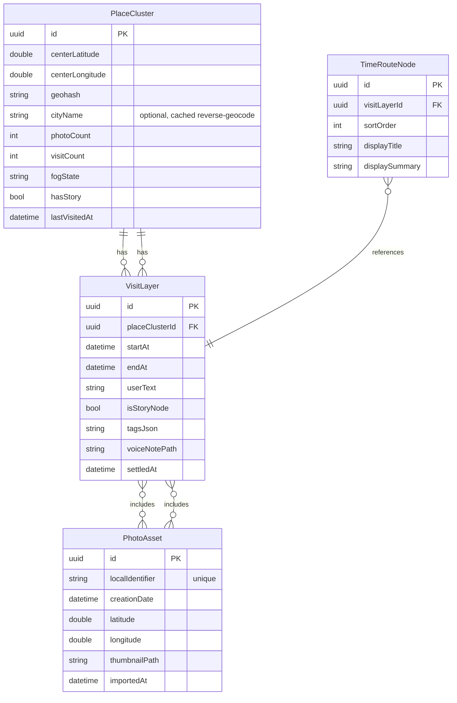
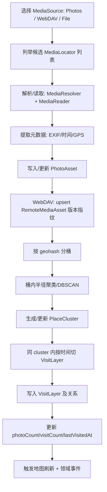
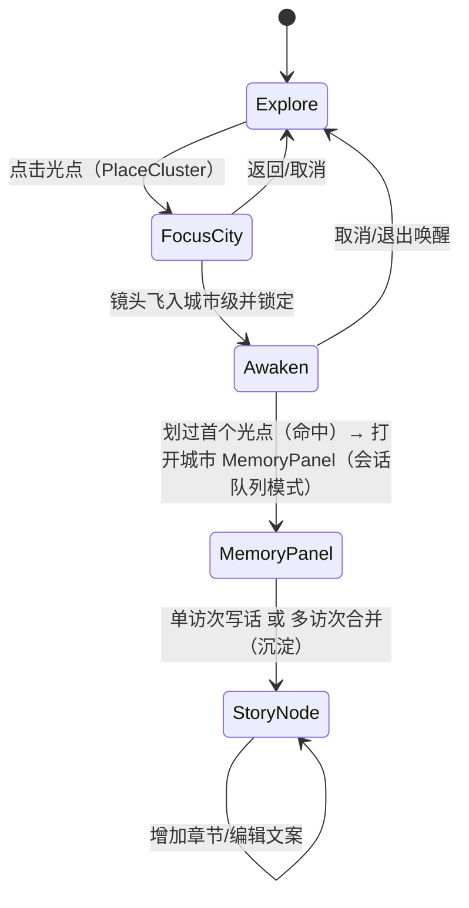

## 拾光星图（Wakelight）iOS 项目架构文档（统一版 / CloudKit(可选) + SQLite/GRDB）

**版本**：1.3-storynode（对齐最新产品）  
**日期**：2026-02-12  

> 目标：把“世界地图”变成“私人情感日记”。以迷雾=遗忘、光点=足迹、缩略图=唤醒（Story Node 显影）；通过“写话沉淀”完成从“到此一游”到“人生故事”的跃迁。  
> 平台：iOS / iPadOS。策略：**离线优先 + 隐私优先 + 客户端为事实源 + 可选云同步（CloudKit）**。  
> MVP：探索（地图+迷雾+聚类+光点）+ 记忆面板（VisitLayers 浏览）+ 写话沉淀（Story Node 显影）+ 本地时光模式（光轨巡航）+ 基础成就（事件驱动）。

---

# 1. 架构原则（铁律）

- **[离线优先（Offline First）]** 所有核心体验（探索、记忆面板、写话沉淀、时光模式、成就）在无网环境下 100% 可用；网络只用于 **可选云同步（CloudKit）** 与可选在线扩展。
- **[客户端为事实源（Client is Source of Truth）]** 迷雾状态、聚类结果、访次分层、成就进度等 **只在本地计算并以本地为准**；CloudKit 只做备份与多端复制，不参与任何体验推导。
- **[隐私优先]** 照片原始内容仍在系统相册；App 仅存 **PHAsset 引用 + 自己的结构化回忆数据**。不上传原图。
- **[模块边界]** Feature 模块禁止互相依赖，只能依赖 `Domain` / `Core`；依赖方向单向：`Features → Domain → Core`。
- **[事件驱动可扩展]** 成就/文化等扩展通过事件总线订阅领域事件，避免横向耦合，便于插件化演进。
- **[性能优先]** 地图与迷雾渲染是主要性能风险：必须做聚类、分级渲染与缓存。

---

# 2. 技术栈总览（最终锁定）

- **语言/运行时**：Swift 5.9+
- **UI**：SwiftUI（主视图）+ UIKit（复杂交互：MapKit 手势 / 粒子系统 / 性能组件）
- **地图与定位**：MapKit + Core Location
- **迷雾与光点渲染**：
  - MVP：Core Graphics / CoreImage + mask（地图足迹层）
  - 进阶：Metal Shader（动态呼吸光点影响场 + 局部迷雾退散）
- **媒体**：Photos + AVFoundation（音效/语音）
- **本地持久化**：SQLite + GRDB（代码驱动迁移，VSCode 可直接查看 .sqlite）
- **文件缓存**：FileManager（缩略图/预览图/语音等大对象）+ LRU
- **加密**：CryptoKit（AES-GCM）+ Keychain（密钥）
- **云同步（可选）**：CloudKit（默认方案）
- **触感**：CoreHaptics

---

# 3. 总体架构（分层 + 依赖方向）

模式：`MVVM + Coordinator + Clean Architecture 轻量版`

依赖方向（单向）：

- `Features → Domain → Core`

分层链路：

- `Presentation(View) → ViewModel → UseCase → Repository → DataSource(SQLite/GRDB + Photos/File/CloudKit)`

## 3.1 模块职责（一句话版）

- `Features`：页面/交互/流程编排（MVVM + Feature 内 Coordinator），不直接触达系统框架与存储细节。
- `Domain`：业务规则与领域模型（Entities / UseCases / Domain Events / Repository Protocol）。
- `Core`：基础设施与系统能力封装（SQLite/GRDB / Photos / File / CloudKit / Crypto 等适配与实现）。
- `DesignSystem`：纯 UI 资产与通用组件（颜色/动效/粒子/音效），不放业务规则。
- `App`：入口 + RootCoordinator + 依赖组装（Composition Root）。

## 3.2 Feature 模块职责

- **Exploration（探索）**：地图浏览、足迹光点展示、定位到访高亮、缩略图节点分层渲染
- **Memory（记忆面板）**：地点容器 + VisitLayers 时间河浏览、照片组预览、写话/标签/语音沉淀
- **Story（显影/故事）**：Story Node 生成与编辑、地图缩略图显影、推荐队列与批量沉淀
- **TimeTravel（时光模式）**：只展示 Story Node，按时间光轨连线巡航、节点阅读/回看
- **Achievement（成就）**：事件监听、规则引擎、徽章墙、解锁动画
- **Culture（文化插件）**：离线诗词/知识库匹配、收藏
- **Settings（设置）**：权限/隐私、云同步开关、备份状态

## 3.3 组件依赖图（Mermaid）

> 说明：该图用于“架构设计阶段”，强调**依赖方向**与**分层边界**；具体类名/实现可在编码阶段再细化。

```mermaid
flowchart TB
  %% 依赖方向（单向）：Presentation -> ViewModels -> Domain -> Data -> DataSources

  subgraph Presentation[Presentation Layer]
    ExploreView
    MemoryPanelView
    TimeTravelView
    BadgeWallView
    SettingsView
  end

  subgraph VM[ViewModels]
    ExploreVM
    MemoryPanelVM
    TimeTravelVM
    AchievementsVM
    SettingsVM
  end

  subgraph Domain[Domain: Entities + UseCases + Events]
    ImportPhotosUC
    ClusterPlacesUC
    UpsertVisitLayerUC
    SettleStoryNodeUC
    MergeVisitLayersUC
    ArchiveDormantLayersUC
    AutoCurateStoryUC
    GenerateTimeRouteUC
    EvaluateAchievementsUC
    MatchCultureUC

    DomainEvents[DomainEvents]
  end

  subgraph Data[Data Layer: Repositories]
    PhotoRepo
    PlaceRepo
    MemoryRepo
    StoryRepo
    FogRepo
    TimelineRepo
    BadgeRepo
    CultureRepo
    SyncRepo
  end

  subgraph DS[SQLite/GRDBSources]
    PhotosDS[Photos.framework]
    SQLiteDS[SQLite/GRDB]
    FileCacheDS[File Cache]
    CloudKitDS[CloudKit]
    KeychainDS[Keychain]
    LocationDS[Core Location]
  end

  %% View -> VM
  ExploreView --> ExploreVM
  MemoryPanelView --> MemoryPanelVM
  TimeTravelView --> TimeTravelVM
  BadgeWallView --> AchievementsVM
  SettingsView --> SettingsVM

  %% VM -> UseCase（按职责分组，避免全连线造成噪声）
  ExploreVM --> ImportPhotosUC
  ExploreVM --> ClusterPlacesUC

  MemoryPanelVM --> UpsertVisitLayerUC
  MemoryPanelVM --> SettleStoryNodeUC

  TimeTravelVM --> GenerateTimeRouteUC

  AchievementsVM --> EvaluateAchievementsUC

  %% UseCase -> Repo
  ImportPhotosUC --> PhotoRepo
  ClusterPlacesUC --> PlaceRepo
  SettleStoryNodeUC --> StoryRepo
  SettleStoryNodeUC --> MemoryRepo
  UpsertVisitLayerUC --> MemoryRepo
  AutoCurateStoryUC --> MemoryRepo
  GenerateTimeRouteUC --> TimelineRepo
  EvaluateAchievementsUC --> BadgeRepo
  MatchCultureUC --> CultureRepo

  %% Repos -> DataSources
  PhotoRepo --> PhotosDS
  PlaceRepo --> SQLiteDS
  MemoryRepo --> SQLiteDS
  StoryRepo --> SQLiteDS
  FogRepo --> SQLiteDS
  TimelineRepo --> SQLiteDS
  BadgeRepo --> SQLiteDS
  CultureRepo --> FileCacheDS
  SyncRepo --> CloudKitDS

  %% Cross-cutting
  ImportPhotosUC --> LocationDS
  EvaluateAchievementsUC --> DomainEvents
  SettleStoryNodeUC --> DomainEvents

  %% Security boundary
  SyncRepo --> KeychainDS
```



---

# 4. 项目目录结构（最终）

```text
Wakelight/
├── App/
│   ├── WakelightApp.swift
│
├── Features/
│   ├── Exploration/
│   ├── TimeTravel/
│   ├── Memory/
│   ├── Story/
│   ├── Achievement/
│   ├── Culture/
│   └── Settings/
│
├── Domain/
│   ├── Entities/
│   ├── UseCases/
│   └── Events/
│
├── Core/
│   ├── Persistence/
│   ├── Cloud/
│   ├── Location/
│   ├── Media/
│   ├── Crypto/
│   └── Utils/
│
├── DesignSystem/
│   ├── Colors.swift
│   ├── Animations/
│   ├── Particles/
│   └── Sounds/
│
├── Resources/
│   ├── Assets.xcassets
│   └── LocalData/
│
└── Tests/
    ├── UnitTests/
    ├── UITests/
    └── Mocks/
```

---

# 5. 数据层设计（SQLite/GRDB + 文件缓存 + 加密边界）

## 5.1 核心思想：数据库存“关系与状态”，不存“原图”

- **不存**：照片原始文件/视频（体积巨大、隐私风险、重复）
- **存**：
  - PHAsset 的 **localIdentifier**（用于从相册取图）
  - 你生成的“光点/访次/解锁/写话/标签/节点/徽章/成就进度”等结构化数据
  - 缩略图、语音等大对象：放沙盒文件系统，数据库只存路径与元信息

## 5.2 GRDB 数据模型（建议 MVP 必需集）

> **迁移说明（最小改动、向后兼容）**：
> - 本轮为支持 **RAW（RW2 等）** 与 **视频（MP4/MOV 等）**，对 `PhotoAsset` 做“加列不改表名”的最小增量。
> - 旧数据：历史记录缺失 `mediaType/uti/pixelWidth/pixelHeight/duration/thumbnailUpdatedAt/thumbnailCacheKey` 时允许为 `NULL`；读取时按默认值处理（例如 `mediaType` 默认 `photo`）。
> - 缩略图重建：当 `thumbnailPath` 缺失、文件被 LRU 淘汰、或媒体版本指纹变化（WebDAV 的 `etag`/`lastModified+size`）时，触发后台重建并更新 `thumbnailUpdatedAt`。

### 5.2.1 `PhotoAsset`

> 说明：该表名沿用 `PhotoAsset`，但逻辑上代表“媒体资产（照片/视频）”。为避免大改代码与表结构，本阶段以 **最小字段增量** 支持 RAW 与视频；后续若需要更强表达力可再抽象为 `MediaAsset`。

- `id: UUID` (PK)
- `localIdentifier: String`（PHAsset id 或 `webdav://...` URI，唯一索引）
- `creationDate: Date`
- `latitude: Double?`, `longitude: Double?`

- `mediaType: String`（`photo` / `video`；**新增**，用于决定缩略图生成管线：downsample vs 抽帧）
- `uti: String?`（Uniform Type Identifier，如 `public.jpeg`/`public.heic`/`com.panasonic.rw2-raw-image`/`public.mpeg-4`；**新增**）
- `pixelWidth: Int?`, `pixelHeight: Int?`（**新增**，便于 UI 预布局/按比例裁切）
- `duration: Double?`（秒；仅视频；**新增**）

- `thumbnailPath: String?`（缩略图落盘路径）
- `thumbnailUpdatedAt: Date?`（缩略图最后生成时间；**新增**）
- `thumbnailCacheKey: String?`（可选：缩略图缓存 key；用于路径迁移/重建；**新增，可为空**）

- `importedAt: Date`

### 5.2.2 `RemoteMediaAsset`（WebDAV 专用，建议）

- `id: UUID` (PK)
- `profileId: String`（区分不同 WebDAV 配置/账号）
- `remotePath: String`（相对路径）
- `etag: String?`
- `lastModified: Date?`
- `size: Int?`
- `photoAssetId: UUID`（FK -> `PhotoAsset.id`）
- `indexedAt: Date`

> **索引建议**：`unique(profileId, remotePath, etag)` 或 `unique(profileId, remotePath, lastModified, size)`。

### 5.2.3 `PlaceCluster`（地图主足迹）

- `id: UUID` (PK)
- `centerLatitude: Double`, `centerLongitude: Double`
- `geohash: String` (Index)
- `photoCount: Int`
- `visitCount: Int`
- `fogState: String`（`locked/revealed`）
- `hasStory: Bool`（是否已显影为 Story Node）
- `lastVisitedAt: Date?`

### 5.2.3 `VisitLayer`（同点多访次分层）

- `id: UUID` (PK)
- `placeClusterId: UUID` (FK)
- `startAt: Date`, `endAt: Date`
- `userText: String?`
- `isStoryNode: Bool`
- `tags: String` (JSON string)
- `voiceNotePath: String?`
- `settledAt: Date?`
- `luminance: Double`（呼吸强度，随时间衰减/手动降噪）
- `isArchived: Bool`（是否已进入归档层）

### 5.2.4 `StoryNode`（显影的故事节点）

- `id: UUID` (PK)
- `placeClusterId: UUID` (FK)
- `mainTitle: String?`
- `mainSummary: String?`
- `coverPhotoId: String` (PHAsset identifier)
- `subStoryIds: String` (JSON array of VisitLayer IDs, 支持章节结构)
- `createdAt: Date`

### 5.2.5 `AchievementProgress`

- `id: UUID` (PK)
- `achievementId: String` (Unique Index)
- `progressValue: Int`
- `isUnlocked: Bool`
- `unlockedAt: Date?`
- `updatedAt: Date`

### 5.2.6 `AwakenState`（唤醒过程持久化：能量条 + 半显影）

- `id: UUID` (PK)
- `placeClusterId: UUID` (FK, Unique Index)
- `energy: Int`（0–100；按划过光点累计，支持权重）
- `isHalfRevealed: Bool`（是否处于半显影状态：微弱缩略图预览 + 呼吸光晕）
- `awakenedPointCount: Int`（本轮累计已触发的光点数量，用于调参/引导）
- `lastAwakenedAt: Date?`
- `updatedAt: Date`

## 5.3 实体关系图（Mermaid ER）



## 5.4 索引与查询（关键）

- **范围查询光点**：基于 `geohash`（或自定义网格 key）先粗筛，再按经纬度精筛
- **聚类稳定**：cluster center 采用平滑更新（避免轻微 GPS 漂移导致光点“跳”）
- **批处理导入**：Photos 导入必须后台队列 + SQLite/GRDB background context + 分批 save

---

# 6. 核心业务流程（Mermaid）

## 6.1 多源媒体索引 → 聚类 → 访次分层



## 6.2 显影（Story Node）状态机



交互与手势约束（工程落地口径）：
- 进入 `Awaken` 后地图中心锁定为城市局部区域，**禁止单指拖动地图**，避免与唤醒滑动冲突。
- `Awaken` 的显影采用 **Pan 滑动命中** 逻辑：
  - 手指路径经过的光点（或光点聚类）逐个触发，产生圆形/放射状散雾。
  - 触发瞬间通过 `DesignSystem/Particles` 与 `DesignSystem/Sounds` 接口发出暖色粒子、haptic（心跳感）与柔和音效反馈。
  - **一键快捷唤醒（吹气仪式）**：
    - 支持通过麦克风检测“吹气”动作（`OnBlow` 事件）。
    - 触发后执行批量逻辑：以触发瞬间地图 `VisibleMapRect/Region` 为筛选范围，且仅作用于**归属于当前城市**的光点；将这些光点对应的 `AwakenState.isHalfRevealed = true`，并全部增量加入 `SessionQueue`，同步更新 `MemoryPanel` UI。
  - 以“会话队列”方式累计本次唤醒结果：
    - 划过**首个光点**时打开城市 `MemoryPanel`（半屏浮层），并将该点对应的 VisitLayer 加入本次会话队列。
    - 后续每次命中光点，都将对应 VisitLayer **增量加入**面板队列，并触发面板内的自动聚合/去重（同一天/同一行程可合并成候选故事组）。
  - `AwakenState` 用于持久化“半显影”与会话统计（例如已触发点数、最后唤醒时间）；不再作为必须“填满能量条”的硬门槛。
  - **持久化状态**：已划过的点标记为 `isHalfRevealed`，记录在 `AwakenState` 中；退出唤醒层后状态保留，下次进入仍可继续在面板中增量加入新的光点。
  - **容错**：`hit-test` 区域应略大于光点视觉尺寸，支持连续划过（画线连接）多个点。

显影与容器逻辑说明：
- **[单一访次写话]**：系统为该 `VisitLayer` 自动创建一个 `StoryNode` 容器，该 VisitLayer 作为唯一的章节。
- **[多访次合并]**：用户手动选择多个 `VisitLayer` 合并，创建一个 `StoryNode` 容器，每个 VisitLayer 成为该故事的一个“章节（Chapter）”。
- **原子动作（同一事务）**：
  - 创建/更新 `StoryNode` 记录。
  - 更新关联的 `VisitLayer.isStoryNode = true` 及其显影属性。
  - 更新 `PlaceCluster.hasStory = true` 触发地图显影。
  - emit `StorySettled(storyId, placeId)` 领域事件。
## 6.3 WebDAV 远程媒体源（轻量索引 + 按需缩略图缓存）

## 6.3A 系统相册（Photos）增量同步（PHPhotoLibraryChangeObserver）

> 目标：系统相册导入要做到“冷启动一次全量、后续增量”，并支持本地删除/修改的同步；避免每次冷启动都全量扫描。

### 6.3A.1 基线与增量

- **首次/冷启动基线**：执行一次全量索引（UseCase：`ImportPhotosUseCase.run(limit: nil)` 或分批分页），建立本地 `PhotoAsset(localIdentifier=PHAsset.localIdentifier)` 基线。
- **增量更新**：通过 `PHPhotoLibraryChangeObserver` 接收系统相册变更事件，仅处理新增/修改/删除集合。

### 6.3A.2 删除同步（可以同步删除）

- `PHPhotoLibraryChangeObserver` 回调中，使用 `PHFetchResultChangeDetails` 获取 `removedObjects`（被删除的 `PHAsset`）。
- 以 `removedAsset.localIdentifier` 为键，从本地数据库删除对应 `PhotoAsset`。
- **关联清理（推荐）**：同步清理 `VisitLayerPhotoAsset` 等关联表，避免 UI 出现孤儿引用。
- 备注：若未来引入“用户文本/故事节点”与照片强绑定，需要定义删除策略（例如：只移除照片引用，不删除用户文本）。

### 6.3A.3 修改同步

- `changedObjects`（被修改的 `PHAsset`）需要重新读取 `creationDate/location/modificationDate` 等字段并更新 `PhotoAsset`；必要时清空缩略图缓存以触发重建。

### 6.3A.4 Limited Photos 权限注意

- 当用户使用 **Limited Photos** 权限时，系统的“授权范围变化”对 App 表现为新增/删除；导入层按变化结果同步即可。
- 产品层面可在设置页提示：变更授权范围会影响导入范围。

### 6.3A.5 工程落地建议

- Core 层新增服务：`PhotosLibraryObserver`（实现 `PHPhotoLibraryChangeObserver`），在 App 生命周期启动时注册。
- Observer 收到变化后，触发 `PhotoImportManager` 的“增量导入入口”（对新增/修改做 upsert，对删除做清理），并做 debounce（例如 0.5~2s）合并频繁变更。

---


> 目标：把 WebDAV 当“本地文件源”来用。除了路径/鉴权/网络适配外，上层（索引、EXIF、缩略图、UI 展示、聚类）尽量复用同一套逻辑，避免在各处写 `if webdav`。

### 6.3.1 统一定位符：`MediaLocator`

把每个媒体对象抽象成定位符（而不是直接在业务层传 `webdav://...` 字符串）：

- 本地相册：`library://<PHAssetLocalIdentifier>`
- 本地文件：`file:///...`
- WebDAV：`webdav://<profileId>/<remotePath>`（**不**把 host/port/username 塞进 identifier）

上层 UseCase/聚类/时间线只关心 `MediaLocator`，不关心来源细节。

### 6.3.2 统一读取：`MediaReader` / `MediaResource`

让 EXIF 提取、downsample、缩略图生成都走同一条“给我 Data / 给我 `CGImageSource`”路径：

- `MediaReader.open(locator) -> bytes / InputStream`
- 本地 file：直接 `FileHandle` / `CGImageSourceCreateWithURL`
- WebDAV：通过 `URLSession` 下载到内存或临时文件，再用 `CGImageSourceCreateWithData/URL`

> 说明：这里的“统一读取”覆盖 **照片（含 RAW）** 与 **视频** 两类媒体，但二者的解码管线不同：
> - 照片/RAW：ImageIO（`CGImageSource`）为主。
> - 视频：AVFoundation（`AVAsset`）为主，最终仍产出一张封面 `CGImage/UIImage` 进入统一的缩略图缓存。

约束：
- 缩略图与 EXIF 提取逻辑**不得**直接依赖 Photos/WebDAV SDK；只依赖 `MediaReader`。

### 6.3.3 统一缓存：`MediaCache`

- 缩略图缓存：`Caches/thumbnails/<hash>.jpg`
- （可选）预览图缓存：`Caches/previews/<hash>.jpg`
- 原图不长期缓存（除非后续明确要离线看原图）

UI 展示策略：
- 有 `thumbnailPath`：直接从本地 `file://` 读
- 无 `thumbnailPath`：通过 `MediaReader` 从源端 downsample/抽帧 即时生成，写回 `MediaCache` 并回填 `thumbnailPath`

补充约束（RAW / 视频）：
- RAW（如 RW2）与视频的“即时生成”都可能很慢：**允许首屏兜底显示低质量/占位图**，但必须尽快在后台生成并落盘，以保证后续滚动/地图交互稳定。
- 缩略图文件格式统一（建议 JPEG；或后续根据系统能力改为 HEIC），避免按源格式扩散导致缓存不可控。

### 6.3.4 WebDAV 索引与元数据提取策略（优化版）

- **轻量扫描**：首先通过递归 `PROPFIND` 获取文件列表及稳定“版本指纹”（etag/size/lastModified）。
- **300MB 安全阈值**：导入阶段仅处理 **≤ 300MB** 的媒体文件。超过此大小的文件将直接跳过（不下载、不解析 GPS、不入库），以保证整体导入的带宽稳定与内存安全。
- **GPS 强制获取（流式提取）**：
  - **核心目标**：必须在导入阶段获取 GPS 以支持地图聚类与“光点”生成。
  - **优先读取 sidecar XMP**：若存在同名 `.xmp`，优先从中提取 GPS（成本最低）。
  - **流式下载提取**：若无 XMP，则通过 `URLSession.download` 下载到本地临时文件（不进入内存 `Data` 对象）。
    - **照片/RAW**：使用 ImageIO 从临时文件提取 EXIF/GPS、像素尺寸及拍摄时间。
    - **视频**：使用 AVFoundation 解析元数据。支持多种 ISO 6709 坐标格式（十进制、度分、度分秒）及多个 metadata keySpace（Common, QuickTime, UserData ©xyz）。
  - **即时清理**：元数据解析完成后，立即删除本地临时文件，防止磁盘空间暴涨。
- **缩略图策略（按需生成）**：
  - **导入阶段不生成**：为了极致的内存稳定和导入速度，导入 Pass 仅负责索引元数据，不触发缩略图生成任务。
  - **UI 触发生成**：当 UI 真正需要展示该资源时（如滑动照片墙），由 `PhotoThumbnailGenerator` 触发生成并写入 `MediaCache`。
  - **生成优化**：生成缩略图时采用流式下载 + `kCGImageSourceShouldCache: false` 参数，确保即便按需生成时也不会产生 OOM 内存风险。

### 6.3.5 WebDAV 视频的远程处理策略（避免“反复整段下载”）

- **目标**：地图/列表滚动时不反复下载同一视频，不在交互主线程抽帧。
- **建议策略（阶段性可逐步增强）**：
  1) 优先命中 `thumbnailPath`（磁盘缩略图）
  2) 未命中时：允许下载到 **临时文件**（tmp）用于一次性抽帧；抽到的封面图必须落 `MediaCache`，临时视频文件可立即删除
  3) 若后续需要更强性能：可引入“分段请求 + 只拉 moov header”的优化，但这属于后续优化项，不阻塞当前架构
- **一致性**：当 `etag/lastModified/size` 变化时，认为远端视频已更新，需要重建缩略图并更新 `thumbnailPath`

> **当前产品策略（阶段性）**：WebDAV 导入暂时仅提供“设置页手动触发”，且实现为全量扫描（递归 PROPFIND）；不参与冷启动/自动导入，以避免耗时与耗电。后续如确有性能需求，再引入客户端目录游标等增量枚举机制。

## 6.4 时光模式节点生成（MVP）


---

# 7. 核心模块工程要点（落地约束）

本章用于把“体验关键路径”写成工程可执行的约束，避免实现分裂与性能回退。

## 7.1 地图 & 迷雾（Fog）

### 7.1.1 渲染架构（性能极致版 1.3）

- **渲染承载方式（最终方案）**：
  - **静态迷雾层**：在 `MKMapView` 上方覆盖一层 `FogView`，使用一个纯黑色半透明的 `CALayer`（`overlayLayer`）作为全局迷雾。该层不使用 mask，不进行重绘。
  - **纹理光晕层（Glow）**：在迷雾层上方叠加一个 `glowContainerLayer`，通过在其内部动态放置 `CALayer` 实例来实现“驱散”效果。
  - **GPU 合成**：每个光晕点使用预渲染的柔边 PNG（`FogHoleSoft`）作为 `contents`。通过调整 layer 的 `opacity`（建议 0.32~0.42）和 `compositingFilter`（如 `screenBlendMode`）实现“照亮/变薄”的视觉感。

- **性能约束（红线）**：
  - ✅ **Layer 复用池**：即使有几万个点，屏幕内同时活跃的 glow layer 必须控制在硬上限内（建议 `maxVisibleGlowLayers = 180`）。
  - ✅ **可见性筛选**：仅对 `visibleMapRect` 内且已解锁（revealed）或正在动画（animating）的点创建/显示 layer。
  - ✅ **跟手优化**：地图缩放/平移期间，禁止重建任何 path 或触发 `setNeedsDisplay`。仅更新已存在 layer 的 `position` 和 `bounds`。
  - ❌ **禁止**：在 `draw(_:)` 中循环绘制、使用 `CGGradient` 在 CPU 做径向渐变、以及每帧重建复杂的 `CAShapeLayer` 路径。

- **视觉权衡**：
  - 采用“局部照亮/变薄”方案替代“硬性挖洞”。这在大量点场景下性能最稳，且视觉上更具梦幻光晕感。

### 7.1.2 交互与更新策略
- **交互中**：仅更新可见 Glow Layer 的屏幕坐标与尺寸，确保 60fps 绝对顺滑。
- **交互结束**：执行一次完整的可见集重算与过期 Layer 回收。

### 7.1.3 动画与视觉（MVP 约束）

- **MVP**：硬边圆洞（`CAShapeLayer` + evenOdd），优先保证性能与稳定。
- **柔边（可选升级）**：
  - 推荐方向：以 **预渲染 alpha 纹理（柔边 PNG）** 叠加为视觉层（仍由 GPU 合成），避免回退到 CPU 渐变。
  - 约束：柔边只能对少量“正在扩散/选中”的点启用，禁止对全量点开启复杂渐变。

### 7.1.4 工程落地检查清单

- [ ] Fog 相关代码中不存在 `override func draw`。
- [ ] 无 `CGGradient` / `drawRadialGradient`。
- [ ] `FogView.layer.mask` 为 `CAShapeLayer` 且 `fillRule = .evenOdd`。
- [ ] 更新发生在 `regionDidChangeAnimated` + 数据变化，而不是 `mapViewDidChangeVisibleRegion` 每帧。
- [ ] Time Profiler 中不再出现 `argb32_shade_radial_RGB`/`argb32_image_mark` 作为主热点。

## 7.2 显影与缩略图（Story Thumbnail）

- **目标**：地图默认只展示“足迹光点”，当 VisitLayer 被沉淀为 Story Node 后，在地图上显影为“照片/视频封面缩略图节点（Story Node Thumbnail）”。
- **渲染承载方式**：
  - 足迹光点：`MKAnnotation`（支持 MapKit clustering）。
  - 缩略图节点：自定义 annotation view（按缩放等级切换展示样式：小尺寸缩略图/封面卡片）。

### 7.2.1 两条链路并存（不推翻原先“能显示缩略图”的实现）

> **定位**：
> - “即时加载链路（Runtime Loader）”负责 **展示当下能看到的图**（少量/开发期/兜底）。
> - “落盘缩略图链路（Disk Thumbnail Cache）”负责 **把缩略图沉淀为可复用资产**（WebDAV + 视频 + 大量点位时的稳定体验）。

**A. 即时加载链路（Runtime Loader，老路，兜底）**
- 代表实现：`Core/Media/PhotoThumbnailLoader`（Photos / WebDAV / file 统一对外提供缩略图/全图的按需加载）。
- 特征：
  - **UI 需要时**从源头取图（Photos 由系统内部做一定缓存/降采样；WebDAV/file 直接解码）。
  - **内存缓存**：使用 `NSCache`（如 `thumbnailCache` / `fullImageCache`）减少短时间重复解码。
- 适用场景：
  - Photos 源（`library://`）为主，或数量较少的列表/详情展示。
  - 作为 `thumbnailPath` 缺失/失效时的兜底。

**B. 落盘缩略图链路（Disk Thumbnail Cache，新路，主路径）**
- 数据面：`PhotoAsset.thumbnailPath`（DB 存相对/绝对路径均可，但需统一约定；建议存相对路径，便于迁移）。
- 存储面：`Core/Media/MediaCache`
  - `Caches/thumbnails/<cacheKey>.jpg`（缩略图）
  - （可选）`Caches/previews/<cacheKey>.jpg`（预览图，给详情页/编辑页用）
- UI 展示策略（**保持现有 UI 基本不动**）：
  1) **优先读** `PhotoAsset.thumbnailPath` → `UIImage(contentsOfFile:)`
  2) 若没有/读取失败 → 走 `PhotoThumbnailLoader` 即时取图
  3) 后台补全：生成缩略图写入 `MediaCache`，并回填 `thumbnailPath`（下次直接命中磁盘缓存）

### 7.2.2 缩略图生成与缓存（统一口径）

- **触发点**：
  - 强触发：`StorySettled`（写话/收藏/标记精华）或系统策展确认 → 生成/刷新对应 Story 封面缩略图。
  - 弱触发：列表/地图首次展示但 `thumbnailPath` 缺失 → 先即时加载保证体验，同时后台补齐落盘缓存。
- **性能约束（红线）**：
  - 禁止在地图交互主线程实时生成缩略图。
  - 缩略图生成必须在后台队列（可取消/可合并）执行。
  - 缩略图节点数量需受控（例如每个 PlaceCluster Top 3–5），避免过载。
- **缓存淘汰**：`MediaCache` 采用 LRU（按文件访问时间/大小）控制上限；DB 中 `thumbnailPath` 若指向已被淘汰文件，读取失败后自动回退即时链路并重建。

### 7.2.3 格式支持矩阵（当前实现状态）

| 媒体类型 | 格式/扩展名 | Photos (library://) | WebDAV / Local (webdav://, file://) | 处理框架 |
| :--- | :--- | :--- | :--- | :--- |
| **通用图片** | JPG, HEIC, PNG, TIFF | ✅ 支持 | ✅ 支持 | ImageIO |
| **RAW 照片** | RW2, DNG, NEF, ARW, CR2, CR3, ORF, RAF | ✅ 支持 | ✅ 支持 (落盘缓存) | ImageIO / Photos |
| **视频** | MP4, MOV, M4V | ✅ 支持 | ✅ 支持 (中间帧抽帧) | AVFoundation |

**实现说明与限制**：
- **WebDAV 视频播放**：当前采用“下载至临时文件后播放”策略。对于超大视频文件，首屏加载可能较慢且受内存限制。
- **RAW 解码**：WebDAV/Local 源的 RAW 缩略图生成依赖系统 ImageIO 解码能力。若遇到特定机型无法解码，将回退至占位图。
- **缩略图标准**：统一生成 **320x320 JPEG**（质量 0.7）并落盘，文件名采用 `MediaLocator` 稳定键的 FNV-1a 64位哈希值。

## 7.3 成就系统（事件驱动终极版）

- **事件枚举是唯一入口**：所有 Feature 只 emit `Domain Events`，成就系统只订阅事件，不反向调用 Feature。
- **规则引擎**：本地 JSON 定义规则 → 监听事件 → 更新 `CDAchievementProgress` → Unlock → 徽章动画。
- **持久化与同步**：
  - 成就进度与解锁结果必须落 SQLite/GRDB（防丢）。
  - 开启 CloudKit 时，可同步 `CDAchievementProgress`（同步的是“结果/进度”，不是规则推导）。

## 7.4 文化系统（Culture）与 边缘侧 AI（On-Device AI）

### 7.4.1 核心理念：离线文化百科 + 智能润色层
- **默认离线**：本地 JSON（`Resources/LocalData`）提供基础诗词/知识库。
- **智能润色层（AI）**：通过统一的 `AITextEngine` 将“原始地理坐标”与“冷冰冰的知识”转化为“有温度的特效文字”。
  - 长期目标：在支持的设备上优先使用 Apple Foundation Models（端侧推理）。
  - 当前实现：使用在线大模型服务（硅基流动 Qwen2.5-7B-Instruct），在无网/失败时自动回退到本地文案。
- **隐私边界**：
  - 离线路径：所有逻辑仅依赖本地 JSON 与客户端状态，不上传坐标或照片信息。
  - 在线路径（可选增强）：仅上传必要的抽象描述（城市名/季节/时间氛围/照片数量等），不上传精确 GPS 与原图内容。

### 7.4.2 AI 赋能：知识“润色”与“时空连结”
当用户划过光点时，AI 承担以下职责：
1. **语义压缩（Summarization）**：将冗长的地理百科压缩为适合“特效文字”展示的极简金句（15字以内）。
2. **时空对齐（Contextualization）**：根据当前季节（Spring/Winter）、时段（Sunset/Midnight），从知识库中筛选并改写最应景的内容。
3. **风格转换（Stylizing）**：根据该地点的属性（荒野 vs 城市），切换 AI 生成的语调（浪漫诗意 vs 硬核地理）。

### 7.4.3 技术架构与数据流
- **模型引擎封装**：统一通过 `Core/AI/AITextEngine` 访问 AI 文本生成能力，对 Feature 隐藏具体模型细节。
  - 长期目标：在支持的系统上优先走 Apple `Foundation Models`（Swift `LanguageModel` / `FoundationModels` 框架，端侧推理）。
  - 当前实现：通过在线服务硅基流动 `Qwen2.5-7B-Instruct (Free)` 生成文案，接口兼容 OpenAI Chat Completions 协议。
- **统一请求模型**：使用 `AITextRequest` 结构体，明确区分：
  - `systemPrompt`：场景级 System Instructions（例如“地理文化向导”、“回忆文案助手”）。
  - `userPrompt`：携带具体上下文的用户输入（地理事实、诗词、时间信息、照片数量等）。
  - `cacheKey`：用于本地缓存命中（例如 `culture:\(geohash_6):\(time_bucket)` / `writing:\(placeId):\(time_bucket)`）。
  - `fallbackText`：当模型不可用或推理失败时回退展示的本地文案。
- **Prompt 策略（System Instructions）**：
  - 地图文化短句场景：  
    “你是一个地理文化向导。请基于提供的[地理事实]和[诗词]，为用户生成一句简短、灵动、且带有‘显影感’的中文。严禁废话。”
  - 写话智能补全场景：  
    “你是一个温柔的回忆文案助手。请基于提供的信息，为用户生成一句简短、真诚、自然的中文句子，适合作为个人回忆的说明文字。禁止废话和空洞鸡汤。”
- **缓存机制**：
  - 地图文化短句：按 `(geohash_6, time_bucket)`（例如日间/夜间、季节等）缓存生成结果，避免对相同区域与时段重复推理。
  - 写话智能补全：按 `(placeId, yyyy-MM-dd-HH)` 缓存生成结果，使同一地点、相近时间段的写话建议保持稳定。
  - 缓存目前采用内存 LRU（由 `AITextEngine` 内部维护简单字典，未来可视需要落库）。
- **降级方案（Fallback）**：
  - 若在线模型不可用（无网络/HTTP 错误/超时/限流等）：`AITextEngine` 自动返回 `fallbackText`。
  - 地图短句场景：`fallbackText` 来自 `CultureService.shortLine(for:)` 提供的本地短句（不依赖 AI）。
  - 写话场景：`fallbackText` 来自现有本地模板（例如“清晨的 XX，留下了 N 个瞬间”等）。

### 7.4.4 特效文字生成流程（AI 参与版）
1. **输入构造**：
   - 地图场景：`[Raw Geo Data] + [Matched Local Poem/Fact] + [Season/Daytime] + [Place Attributes]`。
   - 写话场景：`[地点名称] + [照片数量] + [时间氛围]`。
2. **请求封装**：Feature 根据场景构造 `AITextRequest`（带上 `systemPrompt` / `userPrompt` / `cacheKey` / `fallbackText`），交给 `AITextEngine`。
3. **推理与缓存**：
   - `AITextEngine` 在支持 `LanguageModel` 的系统上执行端侧推理（约 200–500ms），并按 `cacheKey` 将结果写入本地内存缓存。
   - 在不支持或推理失败时，直接返回 `fallbackText`，确保用户始终有文案可见。
4. **输出**：`Refined Text`（如：“此刻你脚下，是沉睡三千年的良渚古城” 或 “这里的这段时光，都被收进了你的相册里”）。
5. **渲染**：
   - 地图场景：调用 `FloatingTextOverlayView.show(text:at:)` + `DesignSystem/Particles`，完成“文字显影”特效。
   - 写话场景：将生成的文本填入写话输入框（`draftText`），用户可直接使用或再编辑。

## 7.5 聚类（Clustering）

- **永远只在客户端**：聚类属于体验推导，CloudKit 不参与计算。
- **实现位置**：`Core/Location/ClusteringService`。
- **算法建议**：DBSCAN（自研轻量）或等价的半径聚类；输入来自 `CDPhotoAsset`（lat/lon/time）。
- **同步边界**：
  - 可同步 `CDPlaceCluster` 的“聚类结果快照”（用于换机快速恢复体验），但聚类仍可在本地重建。

---

# 8. 成就系统（事件驱动 + 规则引擎）

## 8.1 领域事件（Domain/Events）

建议以枚举或结构体方式定义统一事件：

- `LocationUnlocked(placeId)`（地点解锁事件：某个地点从“锁定/迷雾”状态变为“已解锁/可查看”；`placeId` 是地点/聚类的唯一标识）
- `VisitAdded(placeId)`（新增到访事件：系统识别该地点新增了一次到访记录/VisitLayer；用于更新访次、时光轴、成就进度等）
- `StorySettled(visitLayerId, placeId)`（显影完成事件：用户完成写话/沉淀，该访次正式升级为故事节点；触发地图缩略图显影与成就判定）
- `WordsWritten(placeId)`（写话完成事件：用户在该地点写下文字/心情等内容后发出；用于“写话类成就”、时光轴摘要更新等）
- `AnniversaryReached(date)`（纪念日到达事件：到达某个日期节点/周年时触发；`date` 用于判断是否命中纪念日规则）
- `HeavyVisitDetected(placeId, count)`（高频到访事件：检测到某地点到访次数达到某个阈值；`count` 为累计到访次数，用于“常去之地”等成就）

> 事件是跨 Feature 的“唯一粘合剂”。Feature 不互相调用，用事件解耦。

## 8.2 规则引擎

- **规则配置（数据驱动）**：成就规则采用本地 JSON 配置（随版本发布更新；可选用 CloudKit 下发“配置记录/数据包”实现热更新）。
  - JSON 只描述“规则是什么”（id、阈值、监听事件、展示文案等），不承担复杂推导。
- **计算算子（代码实现）**：统计口径与复杂条件由代码实现（算子/策略），规则配置只引用算子，避免 JSON 变成 DSL。
- **计算策略**：
  - 事件驱动：收到事件后只增量更新相关成就进度
  - 状态落库：`CDAchievementProgress` 持久化，避免丢失
- **展示**：解锁动画与徽章墙只订阅“解锁结果”，不参与业务计算

---

# 9. 云同步（CloudKit，客户端事实源）

## 9.1 同步目标

- 默认**不开启同步也完全可用**。
- 开启后做到：
  - 多设备备份/恢复
  - 同一 Apple ID 设备间数据一致

## 9.2 同步边界（云端存什么）

- **不上传**：原图/视频（二次隐私风险 + 体积不可控）
- **可上传**：
  - 结构化回忆数据（clusters/layers/timeline/achievement progress 的必要字段）
  - 缩略图：可选（建议仍以本地生成为主；若上传则仅上传低分辨率且可加密）

## 9.3 客户端优先与冲突策略

- **事实源**：以本地为准；CloudKit 是“同步媒介 + 备份介质”。
- **冲突处理原则**：
  - 单条记录冲突：字段级合并策略（例如 `userText` 采用“最后编辑胜出”，计数类采用 max/累加）
  - 关联关系冲突：以 `updatedAt` 或“集合并集”为主
- **实现建议**：
  - 每个可同步实体带 `updatedAt`、`deviceId`（本地生成并存 Keychain）
  - 写入 CloudKit 前对本地对象做“快照化序列化”（避免把 UI 派生状态传上去）

## 9.4 同步方式（工程可落地）

- **push**：本地对象 dirty mark（或基于 `updatedAt`）→ 映射为 CKRecord → 保存
- **pull**：按 recordType 增量拉取（基于 `modificationDate` 或自建 changeToken 流程）→ 合并写入本地 SQLite/GRDB
- **后台**：使用 CloudKit 的后台能力（后续可选接入订阅推送）

---

# 10. 隐私、安全与权限

- **Photos 权限**：只申请读取
- **定位权限**：可选（用于实时到访高亮），不强制
- **加密策略**：
  - Keychain 保存主密钥/派生种子
  - 用户写话、语音文件可加密存储（AES-GCM）
  - SQLite/GRDB 本身可不全库加密（复杂且影响性能），敏感字段可加密后再存

---

# 11. MVP 开发顺序（现实可落地）

1. 探索模式（地图 + 聚类 + 基本光点 + fog）
2. 记忆面板（VisitLayers）+ 写话沉淀（Story Node）+ 事件 emit
3. 本地时光轴
4. 成就基础（3-5 个简单规则）
5. CloudKit 同步 + 设置页开关
6. 文化插件 + 高级成就

---

# 12. 风险清单与对策

- **[照片量大导致导入慢]**
  - 分批、后台、可暂停/恢复、只做增量
- **[地图上点太多卡顿]**
  - 必须聚类 + 分级显示 + 限制可见 annotation 数
- **[迷雾渲染耗电]**
  - MVP 用静态/低频更新；进阶 Metal 也要做 tile 与帧率控制
- **[GPS 漂移导致光点乱跳]**
  - 聚类阈值 + center 平滑更新 + geohash 稳定映射
