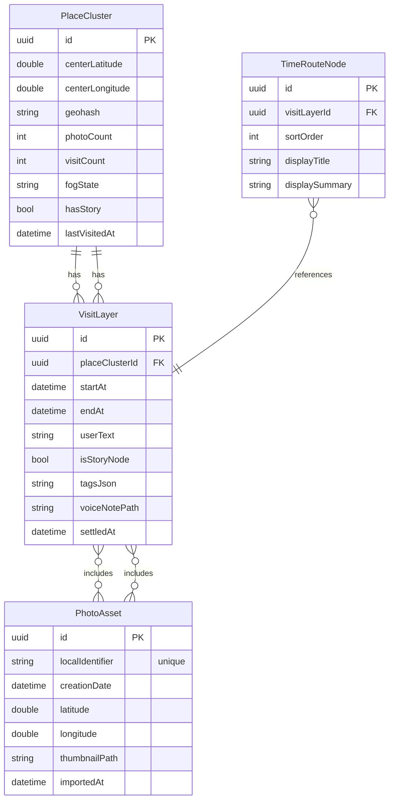
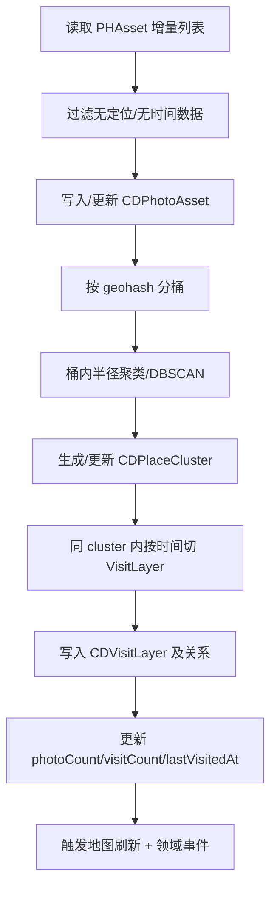
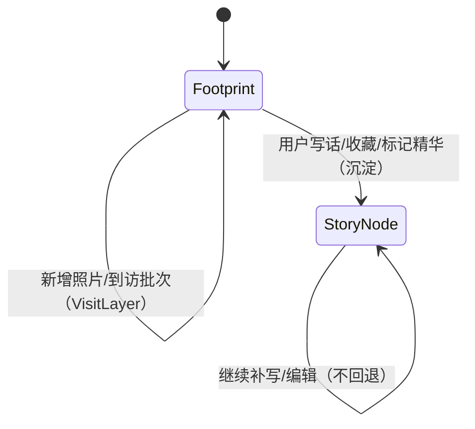
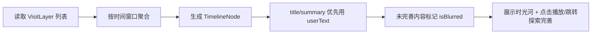

## 拾光星图（Wakelight）iOS 项目架构文档（统一版 / CloudKit(可选) + SQLite/GRDB）

**版本**：1.3-storynode（对齐最新产品）  
**日期**：2026-02-12  

> 目标：把“世界地图”变成“私人情感日记”。以迷雾=遗忘、光点=足迹、缩略图=唤醒（Story Node 显影）；通过“写话沉淀”完成从“到此一游”到“人生故事”的跃迁。  
> 平台：iOS / iPadOS。策略：**离线优先 + 隐私优先 + 客户端为事实源 + 可选云同步（CloudKit）**。  
> MVP：探索（地图+迷雾+聚类+光点）+ 记忆面板（VisitLayers 浏览）+ 写话沉淀（Story Node 显影）+ 本地时光模式（光轨巡航）+ 基础成就（事件驱动）。

---

# 1. 架构原则（铁律）

- **[离线优先（Offline First）]** 所有核心体验（探索、记忆面板、写话沉淀、时光模式、成就）在无网环境下 100% 可用；网络只用于 **可选云同步（CloudKit）** 与可选在线扩展。
- **[客户端为事实源（Client is Source of Truth）]** 迷雾状态、聚类结果、访次分层、成就进度等 **只在本地计算并以本地为准**；CloudKit 只做备份与多端复制，不参与任何体验推导。
- **[隐私优先]** 照片原始内容仍在系统相册；App 仅存 **PHAsset 引用 + 自己的结构化回忆数据**。不上传原图。
- **[模块边界]** Feature 模块禁止互相依赖，只能依赖 `Domain` / `Core`；依赖方向单向：`Features → Domain → Core`。
- **[事件驱动可扩展]** 成就/文化等扩展通过事件总线订阅领域事件，避免横向耦合，便于插件化演进。
- **[性能优先]** 地图与迷雾渲染是主要性能风险：必须做聚类、分级渲染与缓存。

---

# 2. 技术栈总览（最终锁定）

- **语言/运行时**：Swift 5.9+
- **UI**：SwiftUI（主视图）+ UIKit（复杂交互：MapKit 手势 / 粒子系统 / 性能组件）
- **地图与定位**：MapKit + Core Location
- **迷雾与光点渲染**：
  - MVP：Core Graphics / CoreImage + mask（地图足迹层）
  - 进阶：Metal Shader（动态呼吸光点影响场 + 局部迷雾退散）
- **媒体**：Photos + AVFoundation（音效/语音）
- **本地持久化**：SQLite + GRDB（代码驱动迁移，VSCode 可直接查看 .sqlite）
- **文件缓存**：FileManager（缩略图/预览图/语音等大对象）+ LRU
- **加密**：CryptoKit（AES-GCM）+ Keychain（密钥）
- **云同步（可选）**：CloudKit（默认方案）
- **触感**：CoreHaptics

---

# 3. 总体架构（分层 + 依赖方向）

模式：`MVVM + Coordinator + Clean Architecture 轻量版`

依赖方向（单向）：

- `Features → Domain → Core`

分层链路：

- `Presentation(View) → ViewModel → UseCase → Repository → DataSource(SQLite/GRDB + Photos/File/CloudKit)`

## 3.1 模块职责（一句话版）

- `Features`：页面/交互/流程编排（MVVM + Feature 内 Coordinator），不直接触达系统框架与存储细节。
- `Domain`：业务规则与领域模型（Entities / UseCases / Domain Events / Repository Protocol）。
- `Core`：基础设施与系统能力封装（SQLite/GRDB / Photos / File / CloudKit / Crypto 等适配与实现）。
- `DesignSystem`：纯 UI 资产与通用组件（颜色/动效/粒子/音效），不放业务规则。
- `App`：入口 + RootCoordinator + 依赖组装（Composition Root）。

## 3.2 Feature 模块职责

- **Exploration（探索）**：地图浏览、足迹光点展示、定位到访高亮、缩略图节点分层渲染
- **Memory（记忆面板）**：地点容器 + VisitLayers 时间河浏览、照片组预览、写话/标签/语音沉淀
- **Story（显影/故事）**：Story Node 生成与编辑、地图缩略图显影、推荐队列与批量沉淀
- **TimeTravel（时光模式）**：只展示 Story Node，按时间光轨连线巡航、节点阅读/回看
- **Achievement（成就）**：事件监听、规则引擎、徽章墙、解锁动画
- **Culture（文化插件）**：离线诗词/知识库匹配、收藏
- **Settings（设置）**：权限/隐私、云同步开关、备份状态

## 3.3 组件依赖图（Mermaid）

> 说明：该图用于“架构设计阶段”，强调**依赖方向**与**分层边界**；具体类名/实现可在编码阶段再细化。

```mermaid
flowchart TB
  %% 依赖方向（单向）：Presentation -> ViewModels -> Domain -> Data -> DataSources

  subgraph Presentation[Presentation Layer]
    ExploreView
    MemoryPanelView
    TimeTravelView
    BadgeWallView
    SettingsView
  end

  subgraph VM[ViewModels]
    ExploreVM
    MemoryPanelVM
    TimeTravelVM
    AchievementsVM
    SettingsVM
  end

  subgraph Domain[Domain: Entities + UseCases + Events]
    ImportPhotosUC
    ClusterPlacesUC
    UpsertVisitLayerUC
    SettleStoryNodeUC
    AutoCurateStoryUC
    GenerateTimeRouteUC
    EvaluateAchievementsUC
    MatchCultureUC

    DomainEvents[DomainEvents]
  end

  subgraph Data[Data Layer: Repositories]
    PhotoRepo
    PlaceRepo
    MemoryRepo
    StoryRepo
    FogRepo
    TimelineRepo
    BadgeRepo
    CultureRepo
    SyncRepo
  end

  subgraph DS[SQLite/GRDBSources]
    PhotosDS[Photos.framework]
    SQLiteDS[SQLite/GRDB]
    FileCacheDS[File Cache]
    CloudKitDS[CloudKit]
    KeychainDS[Keychain]
    LocationDS[Core Location]
  end

  %% View -> VM
  ExploreView --> ExploreVM
  MemoryPanelView --> MemoryPanelVM
  TimeTravelView --> TimeTravelVM
  BadgeWallView --> AchievementsVM
  SettingsView --> SettingsVM

  %% VM -> UseCase（按职责分组，避免全连线造成噪声）
  ExploreVM --> ImportPhotosUC
  ExploreVM --> ClusterPlacesUC

  MemoryPanelVM --> UpsertVisitLayerUC
  MemoryPanelVM --> SettleStoryNodeUC

  TimeTravelVM --> GenerateTimeRouteUC

  AchievementsVM --> EvaluateAchievementsUC

  %% UseCase -> Repo
  ImportPhotosUC --> PhotoRepo
  ClusterPlacesUC --> PlaceRepo
  SettleStoryNodeUC --> StoryRepo
  SettleStoryNodeUC --> MemoryRepo
  UpsertVisitLayerUC --> MemoryRepo
  AutoCurateStoryUC --> MemoryRepo
  GenerateTimeRouteUC --> TimelineRepo
  EvaluateAchievementsUC --> BadgeRepo
  MatchCultureUC --> CultureRepo

  %% Repos -> DataSources
  PhotoRepo --> PhotosDS
  PlaceRepo --> SQLiteDS
  MemoryRepo --> SQLiteDS
  StoryRepo --> SQLiteDS
  FogRepo --> SQLiteDS
  TimelineRepo --> SQLiteDS
  BadgeRepo --> SQLiteDS
  CultureRepo --> FileCacheDS
  SyncRepo --> CloudKitDS

  %% Cross-cutting
  ImportPhotosUC --> LocationDS
  EvaluateAchievementsUC --> DomainEvents
  SettleStoryNodeUC --> DomainEvents

  %% Security boundary
  SyncRepo --> KeychainDS
```



---

# 4. 项目目录结构（最终）

```text
Wakelight/
├── App/
│   ├── WakelightApp.swift
│
├── Features/
│   ├── Exploration/
│   ├── TimeTravel/
│   ├── Memory/
│   ├── Story/
│   ├── Achievement/
│   ├── Culture/
│   └── Settings/
│
├── Domain/
│   ├── Entities/
│   ├── UseCases/
│   └── Events/
│
├── Core/
│   ├── Persistence/
│   ├── Cloud/
│   ├── Location/
│   ├── Media/
│   ├── Crypto/
│   └── Utils/
│
├── DesignSystem/
│   ├── Colors.swift
│   ├── Animations/
│   ├── Particles/
│   └── Sounds/
│
├── Resources/
│   ├── Assets.xcassets
│   └── LocalData/
│
└── Tests/
    ├── UnitTests/
    ├── UITests/
    └── Mocks/
```

---

# 5. 数据层设计（SQLite/GRDB + 文件缓存 + 加密边界）

## 5.1 核心思想：数据库存“关系与状态”，不存“原图”

- **不存**：照片原始文件/视频（体积巨大、隐私风险、重复）
- **存**：
  - PHAsset 的 **localIdentifier**（用于从相册取图）
  - 你生成的“光点/访次/解锁/写话/标签/节点/徽章/成就进度”等结构化数据
  - 缩略图、语音等大对象：放沙盒文件系统，数据库只存路径与元信息

## 5.2 GRDB 数据模型（建议 MVP 必需集）

### 5.2.1 `PhotoAsset`

- `id: UUID` (PK)
- `localIdentifier: String`（PHAsset id，唯一索引）
- `creationDate: Date`
- `latitude: Double?`, `longitude: Double?`
- `thumbnailPath: String?`
- `importedAt: Date`

### 5.2.2 `PlaceCluster`（地图主足迹）

- `id: UUID` (PK)
- `centerLatitude: Double`, `centerLongitude: Double`
- `geohash: String` (Index)
- `photoCount: Int`
- `visitCount: Int`
- `fogState: String`（`locked/revealed`）
- `hasStory: Bool`（是否已显影为 Story Node）
- `lastVisitedAt: Date?`

### 5.2.3 `VisitLayer`（同点多访次分层）

- `id: UUID` (PK)
- `placeClusterId: UUID` (FK)
- `startAt: Date`, `endAt: Date`
- `userText: String?`
- `isStoryNode: Bool`
- `tags: String` (JSON string)
- `voiceNotePath: String?`
- `settledAt: Date?`

### 5.2.4 `TimeRouteNode`（时光模式节点）

- `id: UUID` (PK)
- `visitLayerId: UUID` (FK)
- `sortOrder: Int`
- `displayTitle: String?`
- `displaySummary: String?`

### 5.2.5 `AchievementProgress`

- `id: UUID` (PK)
- `achievementId: String` (Unique Index)
- `progressValue: Int`
- `isUnlocked: Bool`
- `unlockedAt: Date?`
- `updatedAt: Date`

## 5.3 实体关系图（Mermaid ER）



## 5.4 索引与查询（关键）

- **范围查询光点**：基于 `geohash`（或自定义网格 key）先粗筛，再按经纬度精筛
- **聚类稳定**：cluster center 采用平滑更新（避免轻微 GPS 漂移导致光点“跳”）
- **批处理导入**：Photos 导入必须后台队列 + SQLite/GRDB background context + 分批 save

---

# 6. 核心业务流程（Mermaid）

## 6.1 照片导入 → 聚类 → 访次分层



## 6.2 显影（Story Node）状态机



显影瞬间的原子动作（同一事务/同一 UseCase）：

- 更新 `CDVisitLayer.isStoryNode = true`
- 更新 `CDVisitLayer.settledAt = now`
- 更新 `CDPlaceCluster.hasStory = true`
- 选择/生成该 Story Node 的封面缩略图缓存（文件缓存层）
- emit `StorySettled(visitLayerId, placeId)`（领域事件，见第 8 章）

## 6.3 时光模式节点生成（MVP）



---

# 7. 核心模块工程要点（落地约束）

本章用于把“体验关键路径”写成工程可执行的约束，避免实现分裂与性能回退。

## 7.1 地图 & 迷雾（Fog）

- **渲染承载方式**：以 `MKOverlay` + 自定义 `MKOverlayRenderer` 作为雾层承载（雾层属于地图语义的一部分，天然跟随缩放/平移）。
- **雾层原则**：
  - **雾只表达状态**，不参与聚类/成就等业务推导。
  - **避免全屏重绘**：雾层实现必须支持“低频更新 + 局部重绘”。
- **数据边界（本地事实源）**：
  - `CDPlaceCluster.fogState` 作为业务状态（`locked/partial/revealed`）。
  - 若需要更强“仪式复现”（例如保存刮擦形状），可在 SQLite/GRDB 额外存 `FogSnapshot`（tile/bitmap/压缩数据），但它是**体验缓存**，可重建、可选择不同步。
- **光点与聚合**：
  - 光点采用 `MKAnnotation`。
  - 大量点必须开启 MapKit clustering；当可见点过多时，优先展示 cluster，避免强行展开单点。

## 7.2 显影与缩略图（Story Thumbnail）

- **目标**：地图默认只展示“足迹光点”，当 VisitLayer 被沉淀为 Story Node 后，在地图上显影为“照片缩略图节点”。
- **渲染承载方式**：
  - 足迹光点：`MKAnnotation`（支持 MapKit clustering）。
  - 缩略图节点：自定义 annotation view（按缩放等级切换展示样式：小尺寸缩略图/封面卡片）。
- **缩略图生成与缓存**：
  - 缩略图在后台队列生成并写入文件缓存（LRU），数据库只存路径与版本号/尺寸等元信息。
  - 触发点：`StorySettled`（写话/收藏/标记精华）或系统策展确认。
- **性能约束**：
  - 禁止在地图交互主线程实时生成缩略图。
  - 缩略图节点数量需受控（例如每个 PlaceCluster Top 3–5），避免过载。

## 7.3 成就系统（事件驱动终极版）

- **事件枚举是唯一入口**：所有 Feature 只 emit `Domain Events`，成就系统只订阅事件，不反向调用 Feature。
- **规则引擎**：本地 JSON 定义规则 → 监听事件 → 更新 `CDAchievementProgress` → Unlock → 徽章动画。
- **持久化与同步**：
  - 成就进度与解锁结果必须落 SQLite/GRDB（防丢）。
  - 开启 CloudKit 时，可同步 `CDAchievementProgress`（同步的是“结果/进度”，不是规则推导）。

## 7.4 文化系统（Culture）

- **默认离线**：本地 JSON（`Resources/LocalData`）提供诗词/知识库。
- **匹配策略**：关键词/标签匹配属于 Domain 层策略（可测试），数据读取属于 Core 层 DataSource。
- **热更新（可选）**：可通过 CloudKit 下发“数据包版本信息/配置”，但客户端仍按本地策略匹配与展示。

## 7.5 聚类（Clustering）

- **永远只在客户端**：聚类属于体验推导，CloudKit 不参与计算。
- **实现位置**：`Core/Location/ClusteringService`。
- **算法建议**：DBSCAN（自研轻量）或等价的半径聚类；输入来自 `CDPhotoAsset`（lat/lon/time）。
- **同步边界**：
  - 可同步 `CDPlaceCluster` 的“聚类结果快照”（用于换机快速恢复体验），但聚类仍可在本地重建。

---

# 8. 成就系统（事件驱动 + 规则引擎）

## 8.1 领域事件（Domain/Events）

建议以枚举或结构体方式定义统一事件：

- `LocationUnlocked(placeId)`（地点解锁事件：某个地点从“锁定/迷雾”状态变为“已解锁/可查看”；`placeId` 是地点/聚类的唯一标识）
- `VisitAdded(placeId)`（新增到访事件：系统识别该地点新增了一次到访记录/VisitLayer；用于更新访次、时光轴、成就进度等）
- `StorySettled(visitLayerId, placeId)`（显影完成事件：用户完成写话/沉淀，该访次正式升级为故事节点；触发地图缩略图显影与成就判定）
- `WordsWritten(placeId)`（写话完成事件：用户在该地点写下文字/心情等内容后发出；用于“写话类成就”、时光轴摘要更新等）
- `AnniversaryReached(date)`（纪念日到达事件：到达某个日期节点/周年时触发；`date` 用于判断是否命中纪念日规则）
- `HeavyVisitDetected(placeId, count)`（高频到访事件：检测到某地点到访次数达到某个阈值；`count` 为累计到访次数，用于“常去之地”等成就）

> 事件是跨 Feature 的“唯一粘合剂”。Feature 不互相调用，用事件解耦。

## 8.2 规则引擎

- **规则配置（数据驱动）**：成就规则采用本地 JSON 配置（随版本发布更新；可选用 CloudKit 下发“配置记录/数据包”实现热更新）。
  - JSON 只描述“规则是什么”（id、阈值、监听事件、展示文案等），不承担复杂推导。
- **计算算子（代码实现）**：统计口径与复杂条件由代码实现（算子/策略），规则配置只引用算子，避免 JSON 变成 DSL。
- **计算策略**：
  - 事件驱动：收到事件后只增量更新相关成就进度
  - 状态落库：`CDAchievementProgress` 持久化，避免丢失
- **展示**：解锁动画与徽章墙只订阅“解锁结果”，不参与业务计算

---

# 9. 云同步（CloudKit，客户端事实源）

## 9.1 同步目标

- 默认**不开启同步也完全可用**。
- 开启后做到：
  - 多设备备份/恢复
  - 同一 Apple ID 设备间数据一致

## 9.2 同步边界（云端存什么）

- **不上传**：原图/视频（二次隐私风险 + 体积不可控）
- **可上传**：
  - 结构化回忆数据（clusters/layers/timeline/achievement progress 的必要字段）
  - 缩略图：可选（建议仍以本地生成为主；若上传则仅上传低分辨率且可加密）

## 9.3 客户端优先与冲突策略

- **事实源**：以本地为准；CloudKit 是“同步媒介 + 备份介质”。
- **冲突处理原则**：
  - 单条记录冲突：字段级合并策略（例如 `userText` 采用“最后编辑胜出”，计数类采用 max/累加）
  - 关联关系冲突：以 `updatedAt` 或“集合并集”为主
- **实现建议**：
  - 每个可同步实体带 `updatedAt`、`deviceId`（本地生成并存 Keychain）
  - 写入 CloudKit 前对本地对象做“快照化序列化”（避免把 UI 派生状态传上去）

## 9.4 同步方式（工程可落地）

- **push**：本地对象 dirty mark（或基于 `updatedAt`）→ 映射为 CKRecord → 保存
- **pull**：按 recordType 增量拉取（基于 `modificationDate` 或自建 changeToken 流程）→ 合并写入本地 SQLite/GRDB
- **后台**：使用 CloudKit 的后台能力（后续可选接入订阅推送）

---

# 10. 隐私、安全与权限

- **Photos 权限**：只申请读取
- **定位权限**：可选（用于实时到访高亮），不强制
- **加密策略**：
  - Keychain 保存主密钥/派生种子
  - 用户写话、语音文件可加密存储（AES-GCM）
  - SQLite/GRDB 本身可不全库加密（复杂且影响性能），敏感字段可加密后再存

---

# 11. MVP 开发顺序（现实可落地）

1. 探索模式（地图 + 聚类 + 基本光点 + fog）
2. 记忆面板（VisitLayers）+ 写话沉淀（Story Node）+ 事件 emit
3. 本地时光轴
4. 成就基础（3-5 个简单规则）
5. CloudKit 同步 + 设置页开关
6. 文化插件 + 高级成就

---

# 12. 风险清单与对策

- **[照片量大导致导入慢]**
  - 分批、后台、可暂停/恢复、只做增量
- **[地图上点太多卡顿]**
  - 必须聚类 + 分级显示 + 限制可见 annotation 数
- **[迷雾渲染耗电]**
  - MVP 用静态/低频更新；进阶 Metal 也要做 tile 与帧率控制
- **[GPS 漂移导致光点乱跳]**
  - 聚类阈值 + center 平滑更新 + geohash 稳定映射
